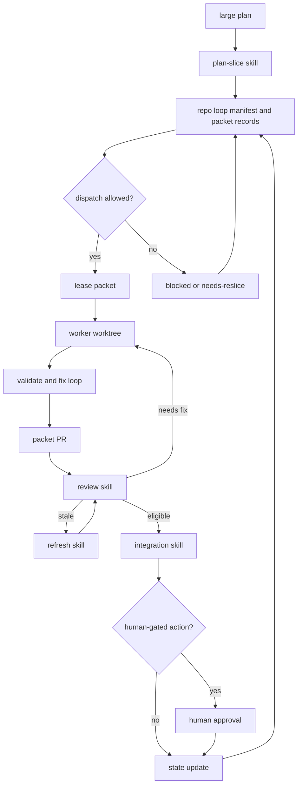

# Codex PR Packet Loop Harness Requirements

## Summary

Build a local Codex Desktop PR packet loop harness as a suite of dedicated skills. The harness turns oversized plans into leased PR packets, runs workers in isolated worktrees, reviews and refreshes packet PRs, reconciles authoritative repo state, and uses local Codex automations to keep the loop moving.

---

## Problem Frame

Large agent-driven plans tend to become slow, fragile implementation runs. One agent works too broadly, produces a large PR, accumulates wrong code or documentation, then gets stuck in a long bug-fix tail where each correction risks expanding the diff further.

The loop exists to make bad work fail small. It should reduce the chance that a single worker owns too much context, hide state in a conversation, or merges broad changes just because they eventually pass a check.

---

## Key Decisions

- **Skill suite over monolith.** Each loop stage should be a dedicated skill that can run standalone or as the next valid step from the prior skill.
- **State files over conversation memory.** The repo holds the authoritative loop state so the process can resume after interruptions, stale threads, or automation restarts.
- **Hybrid enforcement.** Dangerous transitions are strict state-machine gates, while planning, slicing, maintenance, and repair stay flexible enough to unstick the loop.
- **Local Codex Desktop runtime.** The harness targets local Codex Desktop automations and local worktree threads; cloud Codex task orchestration is outside scope.
- **Automation as an actor.** A local controller may dispatch workers, steer active threads, repair state, reslice packets, and reassign stuck work when the state allows it.
- **Worktrees isolate workers.** Every non-orchestrator worker runs in a dedicated worktree so packet-local edits and evidence do not fight the shared checkout.
- **Scripts for deterministic mechanics.** Local CLI helpers may validate schemas, reconcile state, and check invariants, but judgment-heavy orchestration remains visible in Codex Desktop skills and automations.

---

## Actors

- A1. **Human owner.** Approves destructive or externally visible actions and supplies product or risk decisions when the loop cannot decide safely.
- A2. **Repo orchestrator.** Runs loop skills in a specific repo, owns shared state transitions, and reconciles packet results into the repo's authoritative loop state.
- A3. **Central local controller.** Watches multiple repo loop states from local Codex Desktop automation and invokes repo-local skills when work is allowed.
- A4. **Packet worker.** Handles one leased packet in one worktree, runs the bounded implementation and validation loop, and records packet-local evidence.
- A5. **Reviewer.** Checks packet PRs against scope, validation, overlap risk, and review feedback before merge eligibility.
- A6. **Integrator.** Sequences merge candidates, validates state, detects overlap, and stops before human-gated actions.

---

## Requirements

**Skill suite and flow**

- R1. The harness must define dedicated skills for initialization, plan slicing, dispatch, worker execution, review, refresh, integration, maintenance, and automation control.
- R2. Each skill must be usable as a standalone workflow when invoked with valid state.
- R3. Each skill must also emit or record the next valid skill transition when it completes.
- R4. The existing multi-phase orchestration work must remain a reusable foundation for worker-thread dispatch rather than becoming the entire packet-loop product.

**State authority**

- R5. Authoritative loop state must be structured, machine-readable, and stored in the repo.
- R6. Human-readable Markdown dashboards and logs must be derived from, or reconciled against, the structured state.
- R7. The state model must include one repo loop manifest plus per-packet structured records.
- R8. Packet records must capture status, dependencies, risk, allowed scope, expected touched areas, validation route, branch, worktree, PR, lease, evidence paths, and blockers.
- R9. Shared manifest and dashboard updates must be reconciled by orchestrator, maintenance, or integration skills.
- R10. Workers may update only their own packet record and packet-local evidence in their worktree.

**Lifecycle and gates**

- R11. The packet lifecycle must support candidate, ready, reserved, in-progress, PR-open, reviewing, needs-fix, blocked, needs-reslice, merge-eligible, merged, and rejected states.
- R12. Transitions from ready through merged must have explicit preconditions and refusal behavior.
- R13. Planning, slicing, blocked-state repair, reslicing, and reporting may be looser as long as they preserve state validity.
- R14. Merge, branch deletion, PR closing, force-push, default-branch writes, and security-sensitive changes must require human approval.
- R15. The loop must log automatic repairs and state rewrites in a durable human-readable record.

**Leases and ownership**

- R16. Every active packet must have a lease with owner thread, branch, worktree, timestamp, renewal rules, allowed scope, and expiry behavior.
- R17. Stale leases may be repaired automatically when the repair is deterministic.
- R18. Duplicate live leases for the same packet must be treated as a controller-level inconsistency.
- R19. The controller may abandon, reassign, or reslice stuck packets when the action is not destructive or externally visible.

**Worker execution**

- R20. Every non-orchestrator worker must run in a fresh or assigned worktree.
- R21. A worker must implement exactly one packet and must stop rather than expand into adjacent packets.
- R22. A worker must run a bounded implement, validate, fix, and revalidate loop.
- R23. A worker must stop when validation repeatedly fails, scope expands, dependencies are missing, or reserved areas are required.
- R24. A worker must open or prepare one PR for its packet when the packet reaches the PR-ready boundary.
- R25. Worker summaries and success claims must be treated as claims until verified against files, diffs, validation output, PR state, and packet evidence.

**Review, refresh, and integration**

- R26. Review must compare each PR against its packet, validation route, allowed scope, touched files, and known overlap risks.
- R27. The loop must detect file, area, interface, behavior, test, generated-file, dependency, and documentation overlap.
- R28. A stale or conflicted packet PR must go through a refresh flow scoped to the original packet.
- R29. Integration must sequence merge candidates and update state between candidates.
- R30. The integrator must recommend or prepare merge actions but must stop before human-gated actions.

**Automation**

- R31. A central local controller may watch multiple repos that opt into the packet loop.
- R32. The controller must invoke repo-local skills against repo-local state rather than owning hidden state outside the repo.
- R33. The controller may start local Codex worktree threads and message active worker threads when state gates allow it.
- R34. The controller may run maintenance, dispatch, review, refresh, and integration checks on a schedule.
- R35. The controller must prefer deterministic repair when state is stale, incomplete, or inconsistent.
- R36. The controller may use aggressive repair for stuck loops, including reslicing, reassignment, and queue restructuring, when no human-gated action is required.

**Local tooling**

- R37. Deterministic scripts may validate packet schemas, lifecycle transitions, lease expiry, reconciliation integrity, and dashboard consistency.
- R38. Headless Codex CLI may be used only when it improves local automation reliability without hiding orchestration from Codex Desktop visibility.
- R39. The harness must not depend on Codex cloud tasks, GitHub Actions as the loop runner, or hosted task callbacks.

---

## Key Flows

- F1. **Plan to packet queue**
  - **Trigger:** A human or orchestrator provides a large plan that is too broad for one worker.
  - **Actors:** A1, A2
  - **Steps:** The slicing skill reads the plan, creates packet records, marks dependencies and overlap risk, and updates the loop manifest and dashboard.
  - **Outcome:** Packets are small enough for independent worker execution or marked blocked for reslicing.
  - **Covered by:** R1, R5, R7, R8, R11, R13

- F2. **Dispatch to worker**
  - **Trigger:** The controller or repo orchestrator sees ready packets and available capacity.
  - **Actors:** A2, A3, A4
  - **Steps:** Dispatch checks dependencies, overlap, active leases, and worker capacity; reserves a packet; creates or messages a worktree thread; records the lease.
  - **Outcome:** One worker owns one packet in one worktree.
  - **Covered by:** R12, R16, R20, R21, R31, R33

- F3. **Worker loop**
  - **Trigger:** A packet worker receives an assigned packet.
  - **Actors:** A4
  - **Steps:** The worker inspects scoped files, implements the packet, runs validation, fixes packet-caused failures, records evidence, and stops on expansion or repeated failure.
  - **Outcome:** The packet reaches PR-ready evidence, needs-fix, blocked, or needs-reslice without broadening the worker's scope.
  - **Covered by:** R10, R20, R21, R22, R23, R24, R25

- F4. **Review and refresh**
  - **Trigger:** A packet PR is open or a merge changed assumptions under an existing packet PR.
  - **Actors:** A2, A5
  - **Steps:** Review checks scope, validation, evidence, and overlap; refresh resolves staleness within the original packet boundary.
  - **Outcome:** The packet becomes merge-eligible, needs-fix, needs-reslice, or blocked.
  - **Covered by:** R26, R27, R28

- F5. **Integration control**
  - **Trigger:** One or more packets are merge-eligible.
  - **Actors:** A1, A2, A6
  - **Steps:** Integration sequences candidates, checks overlap and current state, prepares the next merge recommendation, and stops for human approval before external or destructive action.
  - **Outcome:** State reflects the recommended merge order and any affected packets.
  - **Covered by:** R14, R15, R27, R29, R30

- F6. **Automation maintenance**
  - **Trigger:** The central local controller wakes on schedule.
  - **Actors:** A3
  - **Steps:** The controller scans opted-in repos, validates state, renews or expires leases, repairs deterministic drift, dispatches allowed work, messages active workers, and logs repairs.
  - **Outcome:** The loop advances or pauses with explicit blockers.
  - **Covered by:** R31, R32, R33, R34, R35, R36

---

## Acceptance Examples

- AE1. **Covers R1, R11, R21.** Given a large plan that would normally become one broad PR, when the slicing skill runs, then it produces multiple packet records with dependencies, risks, and allowed scope rather than dispatching one worker for the whole plan.
- AE2. **Covers R16, R17, R19, R36.** Given a worker lease expires and the thread shows no useful progress, when automation maintenance runs, then it may expire the lease, reassign the packet, or reslice it without asking the human unless the action crosses a human gate.
- AE3. **Covers R20, R21, R25, R26.** Given a worker opens a PR that changes files outside its packet scope, when review runs, then the PR is not treated as complete and the packet moves to needs-fix or needs-reslice.
- AE4. **Covers R14, R29, R30.** Given a packet PR is merge-eligible, when integration runs, then it may prepare a merge recommendation and state updates but must stop before merging or writing the default branch.
- AE5. **Covers R31, R32, R39.** Given the central controller wakes for several opted-in repos, when it advances work, then it invokes local repo skills and local Codex worktree threads rather than cloud tasks or GitHub-hosted runners.

---

## Success Criteria

- Oversized plans are routinely converted into independently reviewable packets before implementation begins.
- Worker threads do not implement adjacent packet work to make their own packet pass.
- A stalled or bad packet can be abandoned, reassigned, or resliced without losing loop state.
- Review and integration decisions can be audited from repo state and logs.
- Human approval remains required for destructive or externally visible actions.
- The loop is visible in Codex Desktop threads and automations, not hidden in a headless background service.

---

## Scope Boundaries

- Cloud Codex task orchestration, GitHub Actions loop runners, and hosted task callbacks are outside scope.
- Fully automatic merging, force-pushing, branch deletion, default-branch writes, PR closing, and security-sensitive changes are outside scope.
- A single monolithic orchestrator skill is outside scope.
- Replacing tests, reviews, or human security judgment with automation confidence is outside scope.
- A future installable plugin distribution is expected, but exact packaging order is deferred to planning.

---

## Dependencies / Assumptions

- Codex Desktop can create local/worktree threads, message threads, inspect thread state, archive threads, and run local automations.
- Target repos support Git worktrees or have a repo-specific equivalent that gives workers isolated checkouts.
- Repos using PR review already have a local PR surface available through `gh` or the installed GitHub connector.
- The existing `multi-phase-orchestrator` skill remains available as an orchestration substrate during implementation planning.

---

## Outstanding Questions

### Resolve Before Planning

- Which structured format should represent the manifest and packet records: JSON, YAML, or another schema-backed format?
- Which exact skill names should the suite expose?
- Which deterministic scripts are required for the first implementation plan versus later hardening?

### Deferred to Planning

- Whether the first implementation lands under `experimental/` before being mirrored into the shipped skill bundle.
- How the local controller discovers opted-in repos.
- How Markdown dashboards are generated, reconciled, or edited.
- Which validation commands apply to each packet type by default.

---

## Sources / Research

- `experimental/codex-pr-packet-loop/README.md` and `experimental/codex-pr-packet-loop/CODEX_PR_PACKET_LOOP_PLAN.md` define the original packet-loop intent, lifecycle, and merge-risk model.
- `experimental/codex-pr-packet-loop/CODEX_PR_PACKET_LOOP_TEMPLATES.md` provides seed prompts and queue/state templates.
- `experimental/codex-pr-packet-loop/MERGE_OVERLAP_STRATEGY.md` defines file, area, interface, behavior, test, generated-file, and dependency overlap categories.
- `experimental/multi-phase-orchestrator/SKILL.md` defines the existing multi-worktree orchestration substrate.
- `AGENTS.md` defines this repo's skill packaging, plugin mirror, and validation constraints.
- [Anthropic: Building effective agents](https://www.anthropic.com/engineering/building-effective-agents) grounds the workflow-plus-agent framing, orchestrator-worker pattern, evaluator-optimizer loop, ground-truth feedback, checkpoints, and stopping conditions.
- [OpenAI Agents SDK: Runner](https://openai.github.io/openai-agents-python/ref/run/) grounds the agent loop shape: invoke, terminate on final output, hand off, or run tools and continue.
- [OpenAI Agents SDK: Handoffs](https://openai.github.io/openai-agents-python/handoffs/) grounds specialized delegation between agents.
- [OpenAI Agents SDK: Guardrails](https://openai.github.io/openai-agents-python/guardrails/) grounds guardrails at workflow and tool boundaries.
- [Temporal: Durable Execution](https://temporal.io/blog/what-is-durable-execution) grounds the durable-state requirement for long-running loops that must survive crashes and waits.
- [OpenAI Codex Skills](https://developers.openai.com/codex/skills) grounds the choice to package reusable workflow stages as skills with `SKILL.md`, optional scripts, references, assets, and agent metadata.
